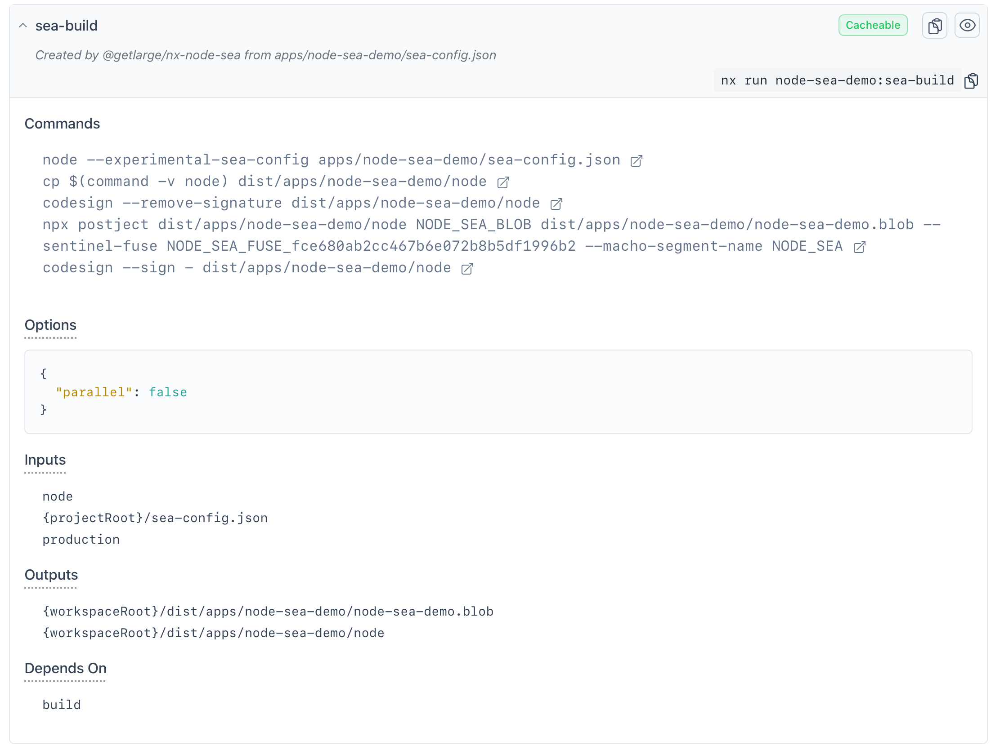

# NodeSeaDemo


NodeSeaDemo is a practical demonstration of a [Single Executable Application](https://nodejs.org/api/single-executable-applications.html) (SEA) built with Node.js and Fastify. This project showcases how to handle file management during compilation, bundling, and runtime in a SEA context.

The application is compiled and bundled with ESBuild and use the [Node SEA Nx plugin](https://github.com/getlarge/nx-node-sea) to create the executable file.



## Features

- **HTTP API**: A simple HTTP API built with Fastify.
- **Static Assets**: Handles bundled static assets.
- **File Uploads**: Supports dynamic file uploads.
- **SEA Assets**: Manages SEA assets.

## Project Structure

- **apps/node-sea-demo**: Main application source code.
- **apps/node-sea-demo-e2e**: End-to-end tests for the application.
- **dist**: Compiled output directory.
- **Dockerfile**: Docker configuration for running the application.
- **Dockerfile.sea**: Docker configuration for building the SEA bundle.

## Getting Started

### Prerequisites

- Node.js >= 20.12.0
- Docker

### Installation

1. Clone the repository:

   ```sh
   git clone https://github.com/your-repo/node-sea-demo.git
   cd node-sea-demo
   ```

2. Install dependencies:

   ```sh
   npm install

   ```

### Running the Application

To run the application locally:

```sh
nx run node-sea-demo:serve
```

To build and run the SEA:

```sh
# Bundle the app and create the SEA
nx run node-sea-demo:sea-build
# Run the SEA
./dist/apps/node-sea-demo-sea/node
```

To build and run the Docker container:

```sh
nx run node-sea-demo:docker-sea-build
docker run --rm -p 3000:3000 -t node-sea-demo:sea
```

### Learn More

For more details, refer to the [presentation](https://slides.com/edouard_maleix/building-single-executable-applications-with-node-js).
